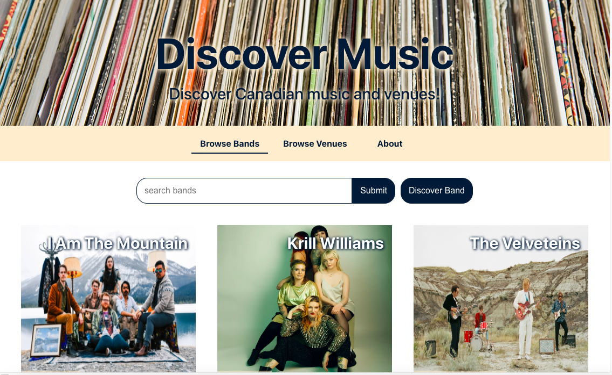
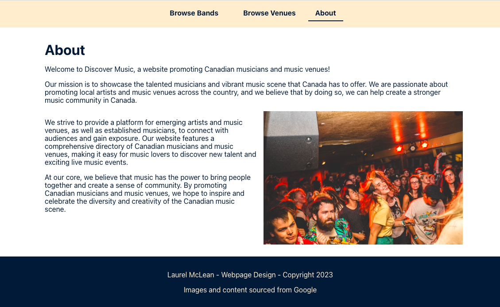
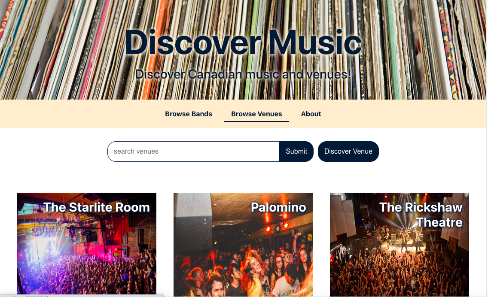

# ACS 1320 - Final Project: Discover Music

A Final Project for ACS 1320 creating a React app, Discover Music, to promote Canadian musicians and music venues. The app allows users to search for bands and venues, view details, and discover new music with the randomize button.

The project was built with React, utilizing components and state.

## Features

- Search for bands or venues 
- View band details, including description, genre, hometown, website
- View venue details, including description, location, website
- Discover bands: click this button to be taken to the details page of a random band
- Discover venues: click this button to be taken to the details page of a random venue

## Installation

1. Clone the repository to your local machine.
2. Navigate to the project directory and install dependencies by running npm install.
3. Start the development server by running npm start.
4. Open the app in your browser.
    
## Usage

### Search

To search for a band or venue, enter a name into the search bar and click "Search". The results will show the image and name. Click on the image for more details.

## To Run

In the project directory, you can run:

### `npm start`

Runs the app in the development mode.\
Open [http://localhost:3000](http://localhost:3000) to view it in your browser.

The page will reload when you make changes.\
You may also see any lint errors in the console.

### The images used in this project were sourced from Google.

## Screenshots

